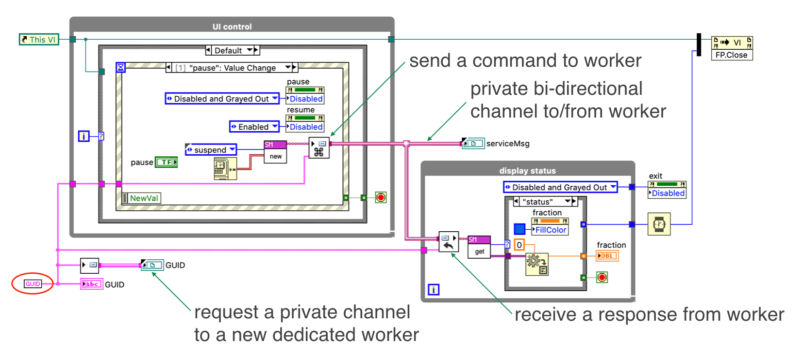
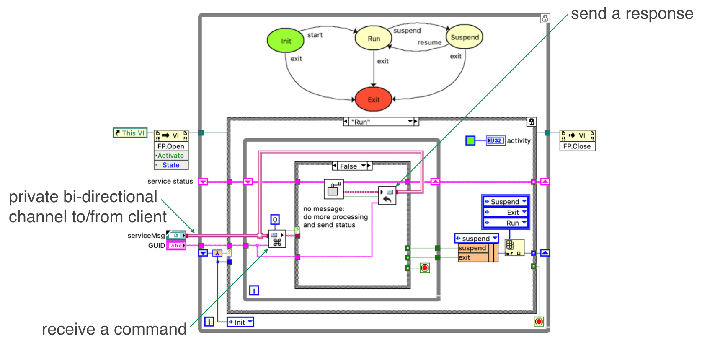

# Multiplexed Messenger Channel (MessengerM)

MessengerM represents multiple Messenger sub-Channels with one wire.

The Multiplexed Messenger Channel is similar to the Messenger Channel in that it is a multi-writer, multi-reader queue, but it is actually an array of such queues.

The endpoints have a full complement of optional inputs and outputs, but the new input that makes this Channel special is the subchannel index.  Different writers and readers can dynamically choose which subchannel they wish to communicate on.

So, where might this be useful?

## Manager-Minion Example

The Manager-Minion example has a manager VI which controls 8 concurrent station VIs (pardon my primitive UI, but that’s not the point of the example; imagine a much nicer UI).

* LEDs show the status of each station.
* The operator can select a station, select a command, and then send it to the station.
* The diagram has the familiar UI event loop, message handling loop (this time 8 of them), and a status display loop (which exits when it detects all stations have exited).
* The connection from the manager to the stations is a Multiplexed Messenger Channel so the manager can direct a command to a specific station using the assigned subchannel.
* The replies from all the stations are merged into a single Messenger channel for display.

> *Caveat: exit event should send exit to stations that haven’t exited yet (no harm as is).*

### Reentrant Station VI

* Continue processing in the Active state until an error is detected or a command is received
* Exit the state diagram loop when the exit command is received
* Read commands on the assigned subchannel

A State Diagram defines the behavior of a Station (note “wizard locked” elements; just a pasted picture of the state diagram as documentation).

A station is in the Off state until it gets a start command.  At that point it goes to the Active state where it does its continuous processing until an error occurs or a command to Pause, Stop, or Exit is received.  From the Error state, a reset command will put it back in the Off state where it can be restarted if and when desired.

**The main thing to notice is that the station reads from its assigned subchannel.  It also includes the assigned subchannel in its status message so the manager can identify the sender.

## Multi-Station Controller Example

This is a simple example but it’s a useful pattern whenever you have an application with a manager and multiple minions.

Here’s a video showing it in operation.

<video controls>
  <source src="content/multistationcontroller.mp4" type="video/mp4">
</video>

Running main creates all the station minions; start station 7; start station 2; start station 6; start station 0; pause station 2; stop station 0; exit station 7; start station 5; start station 4; resume station 2; an error occurs on station 6; reset station 6; start station 6; pause station 4; exit all stations to exit the application.

## Multiplexed Messenger Can Model a Bi-Directional Channel

As I was experimenting with the Multiplexed Messenger Channel, I realized I could use it to model a bi-directional channel.  There could be a policy where a manager could send a message to a minion on channel 2N and receive a reply on channel 2N+1.  Such a policy would be awkward, impossible to enforce, and error prone if someone accidentally wrote on the wrong subchannel.

Then I realized I could make it simpler and more secure by adding two more pairs of otherwise identical endpoints.
* One set is used for the manager to send commands and the other for the minion to send replies.
* Instead of using indices, this pair of subchannels (one in each direction) is identified by a GUID.

So, how might this be used?

### Client-Server Example

Here’s an application pattern with a dynamic number of clients, a server, and worker per client.

* This example has a trivial UI: a button to interactively spawn a new client and a button to exit the example.
* On the diagram, the left loop spawns a new asynchronous client every time the button is pressed.  
* The client sends a request to the server loop (on the right) through the top Channel.  
* For each request, the server spawns a new asynchronous worker with a private subChannel back to the client.

From that point on, the client and worker can exchange messages until they decide they’re finished.

> *Caveat: top level should wait for all async client & worker VIs to finish (otherwise re-running the example will nix communication between clients & workers that haven’t finished yet).*

#### Client And Worker

Client requests a service; the worker reports progress and ultimate completion.
Client can pause & resume the worker; client’s exit causes worker to exit.
The panel on the worker is just for debugging.
The panel on the client enables me to emulate what the client could be doing autonomously.

<video controls>
  <source src="content/demo-3.mp4" type="video/mp4">
</video>

Start the example, the click New to create a client which gets a private worker (see both panels); 
create another client with worker, which the client pauses right away; 
create another, another, another, another, and another which pauses its worker right away;
meanwhile a failure is reported to one client;
spawn a new client which decides to exit immediately;
the previous client resumes its paused worker, which then reports a failure, and the client exits;
more clients exit when their jobs completed successfully or failed;
an early client resumes its paused worker but then exits before the job is done;
the last remaining client decides to exit;
(quit the example)

#### Client

Here’s the client diagram.  

* Nevermind the details, just note the similarity to the UI portion of previous examples: a UI event loop which sends commands, and a status display loop which receives responses, but now both commands and status are transferred over the same private bi-directional subchannel.
* The private subchannel, identified by the client’s GUID, is connected to a dedicated worker, a worker that the server creates when it receives the client’s request (which is just the client’s GUID in this example).

#### Worker

Here’s the worker diagram.

* Never mind the details again, just note the similarity to the processing loop of previous examples: a command is received, causing some processing to take place, and status to be returned, but now both commands and status are on the same private bi-directional subchannel.

## Next Steps

Install the package and run the examples.
